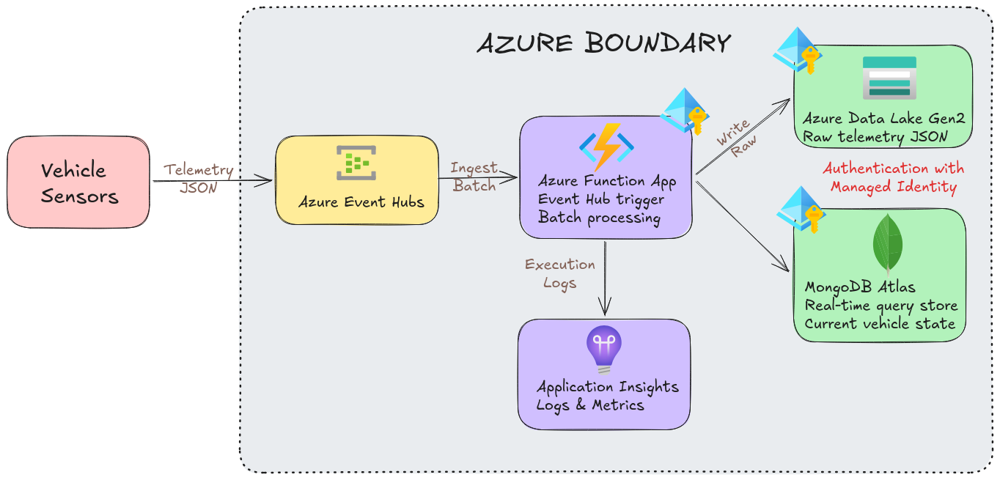

# Car Telemetry MongoDB PoC

This repository contains a proof of concept for real-time vehicle telemetry processing on Azure.

## Architecture

1. A telemetry simulator publishes vehicle sensor events to Azure Event Hubs.
2. An Azure Function (Event Hub trigger) consumes events.
3. The function writes each raw event to Azure Data Lake Gen2.
4. The function writes the telemetry events to documents in MongoDB Atlas for low-latency queries.

Authentication between Azure resources is identity-based using managed identities.

## Repository Structure

- `.azure/deployment-plan.md`: implementation plan and scope.
- `infra/main.bicep`: Azure infrastructure definition.
- `infra/main.parameters.json`: parameter values for deployment.
- `src/function_app/function_app.py`: Event Hub triggered function.
- `src/function_app/host.json`: Function host configuration.
- `src/function_app/local.settings.sample.json`: local settings template.
- `src/function_app/requirements.txt`: function dependencies.
- `scripts/simulate_vehicle_data.py`: telemetry simulator.
- `scripts/bootstrap_mongodb_indexes.py`: creates MongoDB indexes for telemetry queries.
- `requirements.txt`: Python dependencies.

## Architecture Diagram



## Azure Resources Provisioned by Bicep

- Event Hubs namespace + Event Hub (`vehicle-telemetry` by default)
- Storage account with Data Lake Gen2 enabled
- Data Lake file system (container)
- Function App (Linux Consumption) with system-assigned managed identity
- Application Insights + Log Analytics
- RBAC assignments for Function managed identity:
	- `Azure Event Hubs Data Receiver` on Event Hubs namespace
	- `Storage Blob Data Contributor` on storage account

## Prerequisites

- Azure CLI logged in (`az login`)
- Python 3.11+
- Azure Functions Core Tools (for local function runs)
- Existing MongoDB Atlas cluster (**M10 or higher** — OIDC/Workload Identity Federation is not supported on M0, M2, or M5 shared tiers)
- Atlas workload identity federation configured for Azure managed identity / Entra identity

## 1) Deploy Azure Infrastructure

From repository root:

```bash
az group create -n rg-car-telemetry-poc -l westeurope
az deployment group create \
	-g rg-car-telemetry-poc \
	-f infra/main.bicep \
	-p @infra/main.parameters.json
```

Capture outputs:

```bash
az deployment group show \
	-g rg-car-telemetry-poc \
	-n main \
	--query properties.outputs
```

## 2) Configure MongoDB Atlas OIDC

Configure Atlas federated authentication to trust the Azure identity that runs the Function App.

### 2a) Allow outbound IPs in Atlas Network Access

The Function App connects to Atlas over the public internet. Add its outbound IPs to the Atlas IP Access List.

Get the outbound IPs:

```bash
az functionapp show \
	-g rg-car-telemetry-poc \
	-n <your-prefix>-func \
	--query "possibleOutboundIpAddresses" -o tsv | tr ',' '\n'
```

In the Atlas UI → **Security** → **Network Access** → **Add IP Address**, add each IP returned above.

> **Note:** Consumption plan outbound IPs can change. For a stable IP, use VNet integration with a NAT gateway (see hardening steps below).

### 2b) Configure Workload Identity Federation

Set these Function App settings after Atlas is configured:

- `MONGODB_URI`: example `mongodb+srv://<atlas-cluster>.<region>.mongodb.net/`
- `MONGODB_DATABASE`: example `telemetry`
- `MONGODB_COLLECTION`: example `vehicle_state`
- `MONGODB_OIDC_SCOPE`: token scope configured for your Atlas federation (default in code is `https://management.azure.com/.default`)

Set app settings:

```bash
az functionapp config appsettings set \
	-g rg-car-telemetry-poc \
	-n <your-prefix>-func \
	--settings \
	MONGODB_URI="mongodb+srv://<your-atlas-cluster>.mongodb.net/" \
	MONGODB_DATABASE="telemetry" \
	MONGODB_COLLECTION="vehicle_state" \
	MONGODB_OIDC_SCOPE="https://management.azure.com/.default"
```

## 3) Run Function Locally (Optional)

Install dependencies:

```bash
python3 -m venv .venv
source .venv/bin/activate
pip install -r requirements.txt
```

Create local settings from template:

```bash
cp src/function_app/local.settings.sample.json src/function_app/local.settings.json
```

Run the function host:

```bash
cd src/function_app
func start
```

## 4) Run Telemetry Simulator

The simulator authenticates with `DefaultAzureCredential`. For local execution, that means your `az login` identity.

Grant sender role to your identity if needed:

```bash
az role assignment create \
	--assignee <your-object-id> \
	--role "Azure Event Hubs Data Sender" \
	--scope /subscriptions/<sub-id>/resourceGroups/rg-car-telemetry-poc/providers/Microsoft.EventHub/namespaces/<eventhub-namespace>
```

Run simulator:

```bash
python3 scripts/simulate_vehicle_data.py \
	--namespace <your-prefix>ehns.servicebus.windows.net \
	--event-hub vehicle-telemetry \
	--vehicle-count 10 \
	--interval 1 \
	--duration 120
```

## 5) Bootstrap MongoDB Indexes

This script is safe to run multiple times and ensures the collection has these indexes:

- `ux_eventId` (unique, sparse)
- `idx_vehicle_ts` (`vehicleId`, `timestamp desc`)
- `idx_location_2dsphere` (`location` geospatial)
- `idx_status_ts` (`status`, `timestamp desc`)

Run with environment variables already set (`MONGODB_URI`, `MONGODB_DATABASE`, `MONGODB_COLLECTION`):

```bash
python3 scripts/bootstrap_mongodb_indexes.py
```

Or pass explicit arguments:

```bash
python3 scripts/bootstrap_mongodb_indexes.py \
	--uri "mongodb+srv://<atlas-cluster>/?authMechanism=MONGODB-OIDC" \
	--database telemetry \
	--collection vehicle_state \
	--oidc-scope "https://management.azure.com/.default"
```

## Event Example

```json
{
	"eventId": "8c8ab4e8-aa61-4f49-ab3d-5f2a2a4864f0",
	"vehicleId": "car-001",
	"timestamp": "2026-04-01T16:12:22.194113+00:00",
	"speedKph": 76.12,
	"rpm": 2310,
	"engineTempC": 95.6,
	"fuelLevelPct": 74.18,
	"latitude": 40.418121,
	"longitude": -3.706994,
	"odometerKm": 10023.431,
	"status": "active"
}
```

## Notes on Managed Identity

- Event Hub trigger uses identity-based settings via `EventHubConnection__fullyQualifiedNamespace`.
- ADLS writes use `DefaultAzureCredential` in code.
- Atlas writes use `MONGODB-OIDC` callback with `DefaultAzureCredential` token acquisition.
- Function runtime storage (`AzureWebJobsStorage`) in this PoC uses a connection string generated during provisioning.

## Next Hardening Steps

- Add private endpoints and disable public network access.
- Add dead-letter and retry strategy for processing failures.
- Add load tests and cost guardrails.